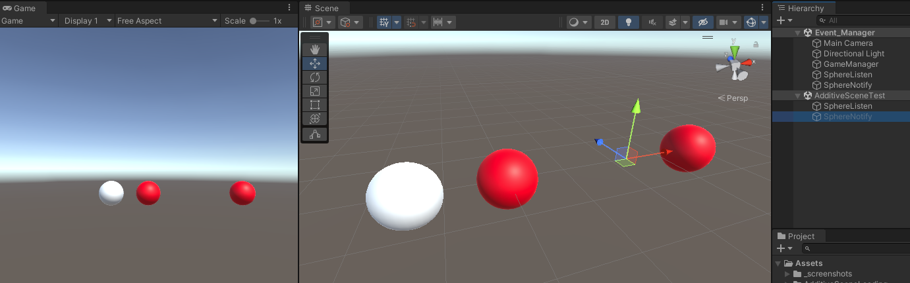
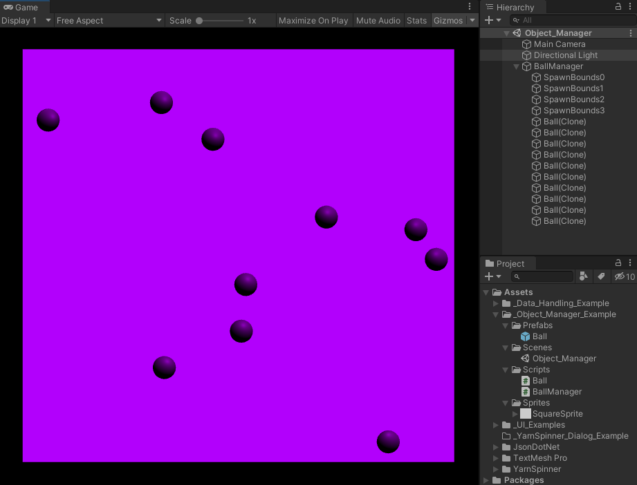
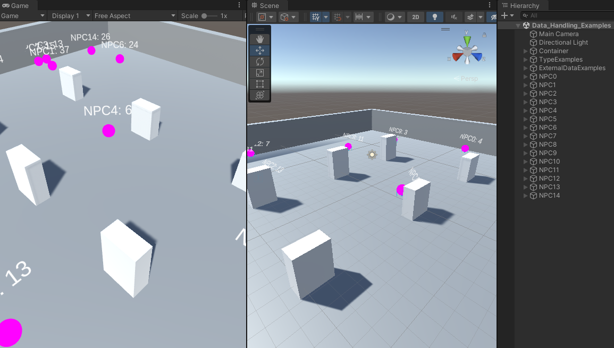
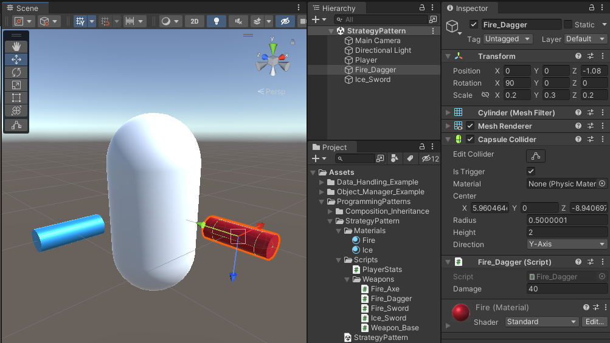

# Sample Unity Data

A sample Unity (2021.2.7f1) project with:

## Event Manager Example

- Notify other game objects (even across additive scenes) about events using [EventManager](https://learn.unity.com/tutorial/create-a-simple-messaging-system-with-events#)

## Object Manager Example

- Spawning new objects using Collider2D bounds
- Moving objects from an origin to a target
- Coroutine to Instantiate new objects

## Data Handling Example

- Working with different C# data types (struct, class, dictionary, etc.)
- Working with external data (e.g. JSON)

## Strategy Pattern

- Implementation of composition over inheritance using C# interfaces

## UI Examples

- Different ways to add UI elements (anchor vs. pixel)
- How to use ray tracing to detect clicks on objects in 3D space
- Clicking, text changes, and data exchange between UI elements
